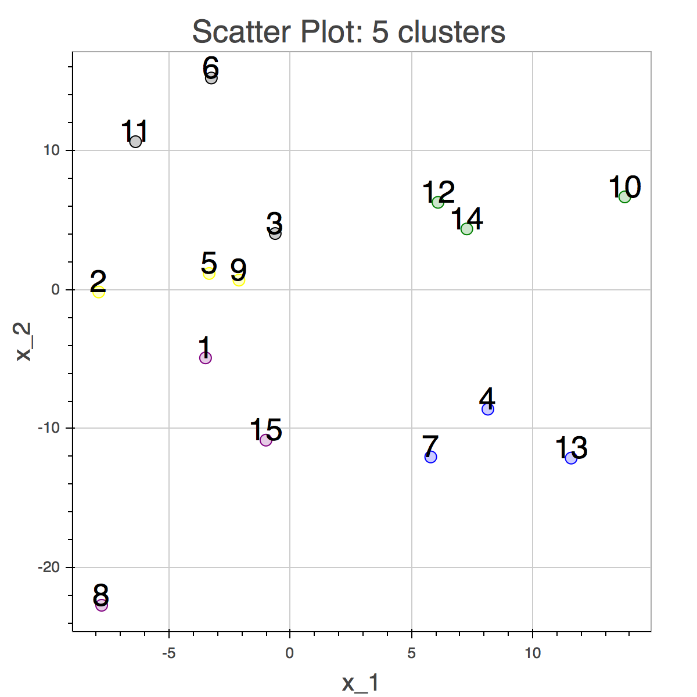

## Agglomerative Hierachical Clustering in Torch

- Two functions with different stopping criteria:
  - the number of clusters
  - the distance threshold
- Linkage covered:
  - single
  - complete
  - centroid
- Dinstance covered:
   - Eucledian
   - Cosine similarity ( normalized to [0, 1] )


### Usage

There are two functions.
```clustering_threshold(x, distf, threshold, linkage)```,
```clustering_nClusters(x, distf, nClusters, linkage)```.

```x```: 2-d tensor that each row represents a data sample, columns represent features.
```distf```: function which caluculate distance. Eucledian distance and Cosine similarity normalized to [0, 1] are covered.
```threshold```: distance or similarity threshold value to stop merging clusters.
```nClusters```: the number of desired clusters.
```linkage```: 'single', 'complete', and 'centroid' are covered

### Sample
```
agg = require 'aggclustering'

-- first dimention is #samples, second is #features
local X = torch.randn(6,6)

-- clustering stops when threshold < all cluster-wise distances
local  threshold = 0.3
local groups, dists, md = agg:clustering_threshold(X, agg.Cosine, threshold, 'single')

-- clustering stops when #clusters is nClusters
local nClusters = 2
groups, dists, md = agg:clustering_nClusters(X, agg.Euclidean, nClusters, 'complete')
print(groups, dists, md)

```

### Clustering sample


check main.lua or clustering_samples_itorch.ipynb for more samples.
